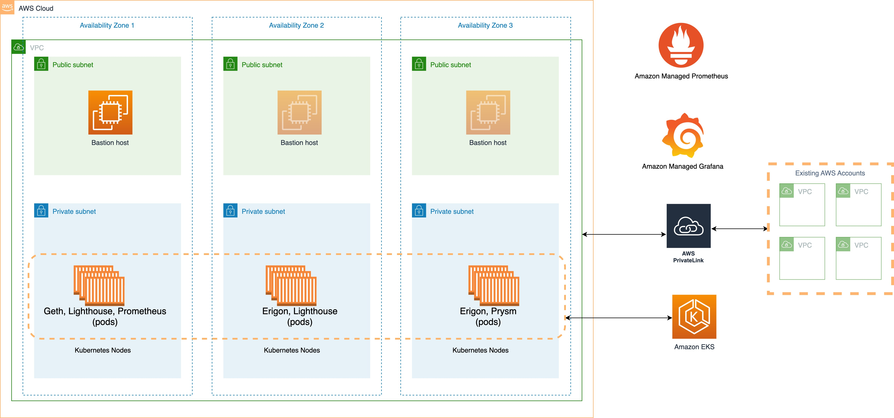

# Deploy an Ethereum staking solution with Amazon EKS and Amazon Managed Prometheus and Grafana
This repository contains a CDK template for deploying an Ethereum execution client, such as Geth or Erigon, and an Ethereum consensus client, such as Lighthouse or Prysm, on an EKS cluster across a configurable set of Availability Zones. This repository also demonstrates how to deploy a Prometheus metrics server and provision a Grafana dashboard with Amazon Managed Service for Grafana.

Two Grafana dashboards, and an Amazon CloudWatch dashboard are deployed to provide insights into the health of the EKS cluster, and the Ethereum clients.

The cluster nodes are deployed on `r7g` Graviton instances which provide the best performance to cost ratio for running Ethereum clients on AWS. Client storage is on Amazon EBS `gp3` volumes. These settings can be easily configured within the deployment template. A Bastion host is also deployed from which we manage the EKS cluster. The EKS cluster is deployed in private subnets, while the Bastion host is in a public subnet.

A couple of things to note. First, in order to provision the Grafana dashboard, your AWS account needs to be part of an Organization, with IAM Identity Center enabled. Instructions to do these can be found below.

Second, the CDK creates an SSH key that you will use to connect to the Bastion host. The key is saved in Parameter Store. For security considerations, it's advised that you delete the key from Parameter Store after you have downloaded it.

Third, the walkthrough deploys this CDK in `us-east-1` in Availability Zones `us-east-1a`, `us-east-1b`, and `us-east-1c`.

Fourth, due to the size of the Ethereum blockchain, client sync time can take a day, to a week, or even longer. The example below installs the Geth client which can be synced within a day using its [snap sync](https://geth.ethereum.org/docs/fundamentals/sync-modes) feature.

With all that behind us, let's move on to deploying the solution.

## Solution Architecture

The diagram below shows the primary components involved in the solution.  



## Deploy this solution

Before deploying, ensure your local environment is configured with your AWS credentials and the region to deploy to. See the [CDK docs](https://docs.aws.amazon.com/cdk/v2/guide/cli.html#getting_started_auth) for more information.

```
git clone <this repo>
cd <this repo>
npm install
```

#### Install CDK
You need to have the CDK cli installed locally. [Follow the steps here](https://docs.aws.amazon.com/cdk/v2/guide/getting_started.html) to install it. Note: version 2.81 of the CDK has a known issue that prevents all the stacks from being deployed at once. Please use version 2.71. If you are installing via npm, you can run ```npm install -g aws-cdk@v2.71.0```.

#### Configure CDK AWS authentication
[Follow the steps here](https://docs.aws.amazon.com/cdk/v2/guide/getting_started.html#getting_started_auth) to configure your AWS credentials.

#### Bootstrap CDK
If this is the first time CDK is being deployed in this account, you need to bootstrap the account:
```cdk bootstrap```

#### Create an Organization
An Organization is required to use Amazon Managed Service for Grafana. If the AWS account is not already part of an Organzation, you can create one on the [Organization page](https://us-east-1.console.aws.amazon.com/organizations/v2/home/accounts).

#### Enable IAM Identity Center and Create a User
In order to log into the Grafana dashboard, you need to create a user from the IAM Identity Center. Visit here to enable [Identity Center](https://us-east-1.console.aws.amazon.com/singlesignon/home), and to create a user.

#### Deploy the CDK
```cdk deploy -c cluster_name=ethereum-staking-cluster -c availability_zones=us-east-1a,us-east-1b,us-east-1c --app "npx ts-node --prefer-ts-exts bin/app.ts" --all --require-approval never```

This will deploy multiple Cloudformation stacks. This will take around one hour to complete. Once the stacks have deployed, we can deploy the Ethereum clients.

### Connect to kubectl
We need to communicate with our EKS cluster from our Bastion host, as the cluster is not accessible via the public internet. We can either connect to the Bastion Host via Session Manager, or ssh from our local environment. In this walk through we will connect from our local environment.

1. Download the ssh key we created in the solution. The key is in [Parameter Store](https://us-east-1.console.aws.amazon.com/systems-manager/parameters/?region=us-east-1&tab=Table) and has a naming convention like `/ec2/keypair/key-123abc...`
2. Click the key name, and then click **Show**.
3. On your local device, `cd ~/.ssh` and create a new file called `bastionHostKeyPair.pem`. For example, with `vi`: ```vi bastionHostKeyPair.pem```
4. Add the contents of the key you copied from Parameter Store into `bastionHostKeyPair.pem` and save the file.
5. Set the correct file permissions: ```chmod 400 bastionHostKeyPair.pem```
5. Connect to the Bastion Host. You can find the public IP address of your Bastion Host on the [EC2 console](https://us-east-1.console.aws.amazon.com/ec2/home?region=us-east-1#). You can find an example of how to connect on the `Connect` page of the `EKS/BastionEKSHost` instance. It will be something like this: ```ssh -i ~/.ssh/bastionHostKeyPair.pem ec2-user@<public ip address of Bastion host>```

### Update the kubeconfig file
In order to access the EKS cluster, we must first authorize our local environment. The **Outputs** tab of our `EKS` Cloudformation stack includes the command we can run to authorize our local environment to work with the cluster.
1. From the [Cloudformation Console](https://us-east-1.console.aws.amazon.com/cloudformation/home?region=us-east-1), open the `EKS` stack you just deployed, and browse the Outputs tab. Look for a Key called `EKSClusterConfigCommand`. Copy the value.
2. From the Bastion host, paste this value, and click enter.

Your local environment is now authorized to communicate with your EKS cluster.

Next we need to configure your local environment's `kubeconfig` file for `kubectl`. We need to supply the name of our EKS cluster to the command below. The EKS cluster name can be found within the command you ran above for updating the kubeconfig file. You can also find it on the [EKS console](https://us-east-1.console.aws.amazon.com/eks/home?region=us-east-1#/clusters): ```aws eks update-kubeconfig --name <ethereum-staking-cluster-name> --region us-east-1```

### Install Helm
Helm should already be installed on the Bastion host. If you need to install it, you can follow the steps on the [Helm website](https://v3-1-0.helm.sh/docs/intro/install/#from-script).

At this point we have a running EKS cluster and a Bastion host that is authorized to manage the cluster. Pat yourself on the back, you've already come a long way. From here on out, we are going to be installing the Ethereum clients.

## Install the Ethereum clients and Prometheus monitoring
We use [Helm charts from Stakewise](https://docs.stakewise.io/node-operator/stakewise-infra-package/usage#eth2-consensus-beacon-nodes) to deploy the clients.

From the Bastion host:

### Install the StorageClass
1. We need to create our `storageClass` that our clients will use. We create a storageclass for `gp3` volumes. Copy the contents of the `lib/storageClass.yaml` file into an identically named file, on the Bastion host, and then run: ```kubectl apply -f storageClass.yaml```

### Generate a shared JWT
2. The execution and consensus client share a JWT to authenticate. We generate and set one in our environment.
```export JWT=`openssl rand -hex 32` ```


### Install the Geth execution client
We install three replicas of the Geth client.

```
helm repo add stakewise https://charts.stakewise.io
helm repo update
helm upgrade --debug --install geth stakewise/geth \
  --set='global.replicaCount=3' \
  --set='global.network=mainnet' \
  --set='global.metrics.enabled=true' \
  --set='global.metrics.serviceMonitor.enabled=true' \
  --set='global.metrics.prometheusRule.enabled=true' \
  --set='global.livenessProbe.enabled=false' \
  --set='global.readinessProbe.enabled=false' \
  --set='persistence.storageClassName=ebs-gp3-storageclass' \
  --set='metrics.serviceMonitor.namespace=monitoring' \
  --set='metrics.serviceMonitor.additionalLabels.release=kube-prometheus' \
  --set='global.JWTSecret='${JWT} \
  --create-namespace \
  --namespace chain
```

### Install the Lighthouse consensus client
Install Lighthouse, once the geth pods are up and running.
```
helm upgrade --debug --install lighthouse stakewise/lighthouse \
  --set='global.network=mainnet' \
  --set='global.JWTSecret='${JWT} \
  --set='global.executionEndpoints[0]=http://geth-0.geth.chain:8551' \
  --set='global.executionEndpoints[1]=http://geth-1.geth.chain:8551' \
  --set='global.executionEndpoints[2]=http://geth-2.geth.chain:8551' \
  --set='global.metrics.enabled=true' \
  --set='global.metrics.serviceMonitor.enabled=true' \
  --set='global.metrics.prometheusRule.enabled=true' \
  --set='global.livenessProbe.enabled=false' \
  --set='global.readinessProbe.enabled=false' \
  --set='checkpointSyncUrl=https://beaconstate.ethstaker.cc/' \
  --set='persistence.storageClassName=ebs-gp3-storageclass' \
  --set='metrics.serviceMonitor.namespace=monitoring' \
  --set='metrics.serviceMonitor.additionalLabels.release=kube-prometheus' \
  --create-namespace \
  --namespace chain
```

## Review the setup
To monitor the pods and logs, these commands may be helpful:  
```kubectl get pods -A```  
```kubectl logs geth-0 -n chain```  
```kubectl describe pod geth-0 -n chain```  
```kubectl exec -i -t geth-0 --container geth -n chain -- sh``` -- connect to the Container


## Logging and Monitoring

### Logging

Check `/aws/containerinsights/<ethereum-staking-cluster-name>/application` CloudWatch log group for the client logs. For checking EKS/System logs, check the following logs groups:
```
/aws/containerinsights/<ethereum-staking-cluster-name>/host
/aws/containerinsights/<ethereum-staking-cluster-name>/dataplane
```

### Monitoring
For accessing Grafana, [follow the steps here](https://docs.aws.amazon.com/grafana/latest/userguide/AMG-manage-users-and-groups-AMG.html) to configure AWS IAM Identity Center users/user groups.  

Once you setup the users & obtain the access to Grafana dashboard, add the Amazon Prometheus as a data source by [following the steps here](https://docs.aws.amazon.com/grafana/latest/userguide/AMP-adding-AWS-config.html).  

[Follow the steps here](https://docs.aws.amazon.com/grafana/latest/userguide/v9-dash-managing-dashboards.html#v9-dash-export-import-dashboards) to import the following dashboards to visualize EKS & Geth metrics:

| Dashboard                                  | ID/Json |
|:-------------------------------------------|:--------|
| Geth System Resources  |  [dashboard.json](./dashboards/geth_system_resources.json)  |
| Geth Transaction Processing  |  [dashboard.json](./dashboards/geth_transaction_processing.json)  |
| Lighthouse Consensus | [dashboard.json](./dashboards/lighthouse_dashboard.json)  |
| k8s-views-global |  15757  |
| k8s-views-namespaces |  15758  |
| k8s-views-nodes |  15759  |
| k8s-views-pods |  15760  |
| k8s-system-api-server |  15761  |
| k8s-system-coredns |  15762  |
| k8s-addons-prometheus |  19105  |

## Security

See [CONTRIBUTING](CONTRIBUTING.md#security-issue-notifications) for more information.

## License

This library is licensed under the MIT-0 License. See the LICENSE file.
